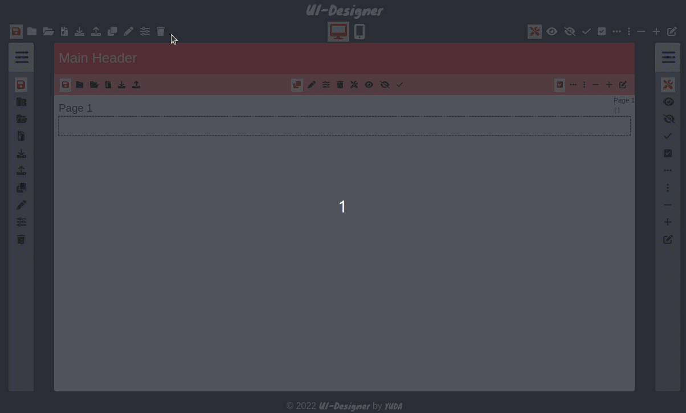

# ui-designer

UI-Designer is a WYSIWYG (drag and drop) template to create a user interface.

## Layout

<center>



</center>

This template should help get you started developing with Vue 3 in Vite.

## Project Setup

```sh
npm install
```

### Compile and Hot-Reload for Development

```sh
npm run dev
```

### Compile and Minify for Production

```sh
npm run build
```